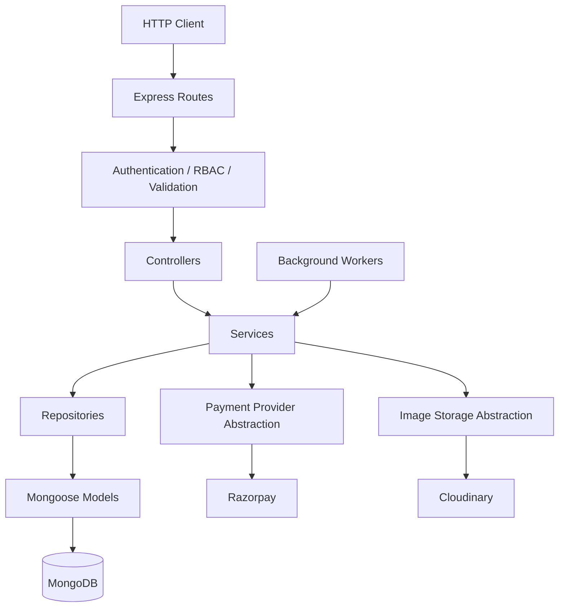
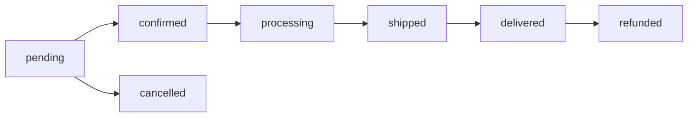
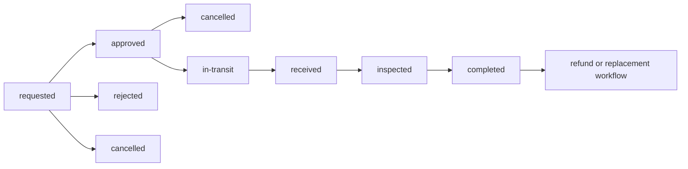
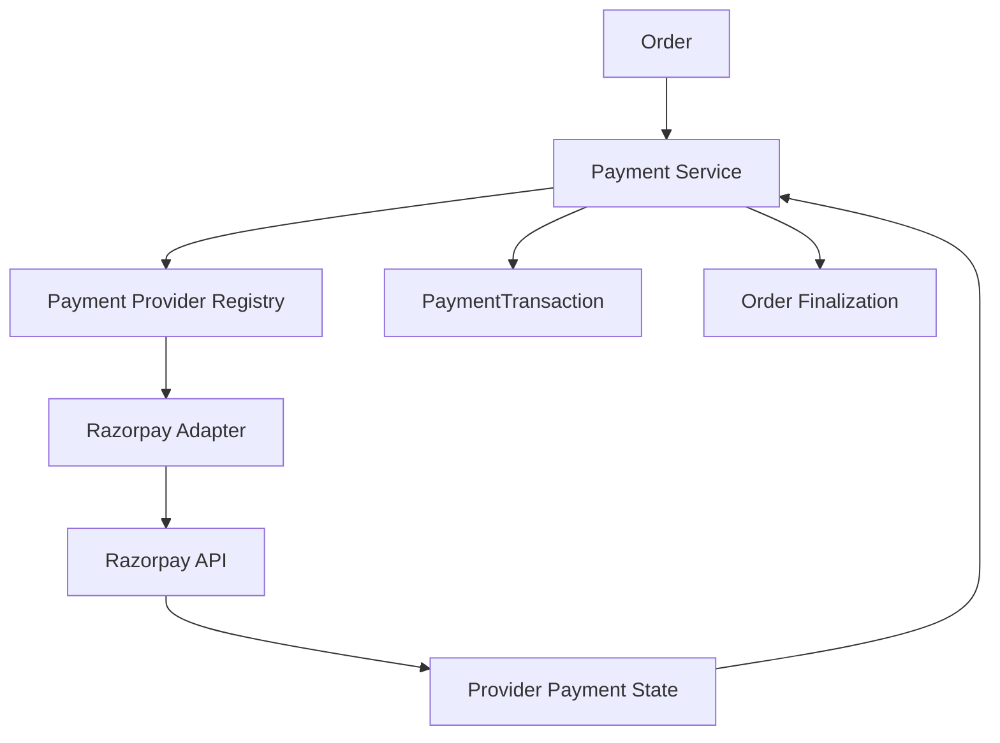

# Clothing Commerce API — Backend v1

Production-style MERN backend for a clothing e-commerce application. The API supports public catalog browsing, customer authentication and shopping flows, admin catalog management, atomic inventory, orders, returns, replacements, Razorpay payments, webhook recovery, background workers, Cloudinary image storage, operational audits, seed safety, and a large automated test suite.

> **Backend v1 checkpoint:** finalized and verified on **2026-09-24**.

---

## Table of Contents

1. [Final v1 Status](#final-v1-status)
2. [Core Features](#core-features)
3. [Technology Stack](#technology-stack)
4. [Architecture](#architecture)
5. [Project Structure](#project-structure)
6. [Module Overview](#module-overview)
7. [Database Models](#database-models)
8. [Authentication and Authorization](#authentication-and-authorization)
9. [Security Controls](#security-controls)
10. [API Conventions](#api-conventions)
11. [Complete Route Inventory](#complete-route-inventory)
12. [Catalog Query Capabilities](#catalog-query-capabilities)
13. [Inventory Architecture](#inventory-architecture)
14. [Order Lifecycle](#order-lifecycle)
15. [Returns and Replacements](#returns-and-replacements)
16. [Payment Architecture](#payment-architecture)
17. [Razorpay Webhooks](#razorpay-webhooks)
18. [Background Workers](#background-workers)
19. [Product Image Storage](#product-image-storage)
20. [Idempotency and Concurrency](#idempotency-and-concurrency)
21. [Environment Variables](#environment-variables)
22. [Local Setup](#local-setup)
23. [Development Seed Workflow](#development-seed-workflow)
24. [NPM Commands](#npm-commands)
25. [Operational Scripts](#operational-scripts)
26. [Postman](#postman)
27. [Testing](#testing)
28. [Logging and Error Handling](#logging-and-error-handling)
29. [MongoDB Index Strategy](#mongodb-index-strategy)
30. [Production Readiness Notes](#production-readiness-notes)
31. [Known v1 Boundaries and Post-v1 Advisories](#known-v1-boundaries-and-post-v1-advisories)
32. [Example Requests](#example-requests)
33. [Backend v1 Acceptance Snapshot](#backend-v1-acceptance-snapshot)

---

## Final v1 Status

| Check | Final Result |
|---|---:|
| Test files | **44 / 44 passed** |
| Automated tests | **1079 / 1079 passed** |
| Production dependency audit | **0 vulnerabilities** |
| MongoDB models audited | **19 / 19 passed** |
| Missing or different indexes | **0** |
| Circular ES-module imports | **0 found** |
| `git diff --check` | **Clean** |
| Architecture review | **Complete** |
| Deployment-readiness review | **Complete** |

The backend is frozen at a stable v1 checkpoint. The final architecture review found no release-blocking backend issue.

---

## Core Features

- Customer registration, login, refresh-token rotation, logout, and current-user retrieval.
- HTTP-only JWT cookie authentication with customer/admin role-based access control.
- Public catalog APIs for categories, brands, size guides, collections, and products.
- Admin catalog CRUD with soft-delete/restore flows.
- Product variants, pricing, colors, shipping metadata, SEO, images, and inventory.
- Cloudinary-backed product image upload, replacement, metadata update, and deletion.
- Shopping cart, wishlist, and recently viewed lists.
- Atomic product stock operations: adjust, reserve, release, and commit.
- Durable product inventory ledger.
- Customer order creation with trusted checkout snapshot and inventory reservation.
- Checkout idempotency protection.
- Cash-on-delivery and online payment flows.
- Razorpay provider adapter and provider registry abstraction.
- Browser payment confirmation with cryptographic signature verification.
- Signed Razorpay webhook ingestion using the original raw request body.
- Durable webhook inbox, retry processing, dead-letter handling, admin requeue, and worker health.
- Payment reconciliation worker for paid-payment/order-finalization recovery.
- Online-order reservation expiry worker.
- Shipping, delivery, cancellation, refund, return, warehouse inspection, and replacement flows.
- Return operational metrics and trend endpoints.
- Structured Pino request/application logging with sensitive-header redaction.
- Helmet, CORS, CSRF checks, rate limiting, strict request validation, body limits, and production-safe error responses.
- Seed preflight and hard database-target safety.
- Read-only model/index audit and multiple integrity audit tools.
- Vitest + Supertest integration/unit tests using an in-memory MongoDB replica set.

---

## Technology Stack

| Area | Technology |
|---|---|
| Runtime | Node.js **>= 22.2.0** |
| API | Express **5.x** |
| Database | MongoDB + Mongoose **9.x** |
| Validation | Zod **4.x** |
| Authentication | JWT + HTTP-only cookies |
| Password hashing | bcryptjs |
| Security | Helmet, CORS, CSRF source validation, express-rate-limit |
| Logging | Pino + pino-http |
| File upload | Multer memory storage |
| File-content verification | `file-type` |
| Image storage | Cloudinary |
| Payments | Razorpay |
| Testing | Vitest, Supertest, mongodb-memory-server |
| Development | Nodemon |
| Modules | ECMAScript modules (`"type": "module"`) |

---

## Architecture

The application follows a layered modular architecture:



### Layer responsibilities

| Layer | Responsibility |
|---|---|
| Routes | HTTP method/path declaration and route middleware |
| Controllers | Translate validated HTTP input into service calls and HTTP responses |
| Services | Business rules, workflow orchestration, transactions, cross-module coordination |
| Repositories | Persistence queries, atomic updates, database reads/writes |
| Models | Mongoose schemas, indexes, embedded documents, persistence constraints |
| Validation | Strict body/params/query validation with Zod |
| Mappers | Public/admin response shaping |
| Workers | Background recovery and queue processing |

Architecture review confirmed that services do not directly perform normal Mongoose model persistence calls, repositories do not depend on controllers/services, and no circular ES-module import was found.

---

## Project Structure

```text
backend/
├── .env.example
├── package.json
├── package-lock.json
├── vitest.config.js
├── intallation.txt
├── postman/
│   ├── Clothing-Commerce-API.postman_collection.json
│   └── Clothing-Commerce-Local.postman_environment.json
├── src/
│   ├── app.js
│   ├── server.js
│   ├── config/
│   │   ├── cloudinary.js
│   │   ├── database.js
│   │   ├── environment.js
│   │   └── logger.js
│   ├── middlewares/
│   ├── modules/
│   │   ├── addresses/
│   │   ├── auth/
│   │   ├── brands/
│   │   ├── cart/
│   │   ├── categories/
│   │   ├── collections/
│   │   ├── orders/
│   │   ├── payments/
│   │   ├── products/
│   │   ├── recently-viewed/
│   │   ├── size-guides/
│   │   ├── users/
│   │   └── wishlist/
│   ├── routes/
│   ├── scripts/
│   ├── seeds/
│   ├── services/
│   └── shared/
└── tests/
    ├── helpers/
    ├── integration/
    ├── setup/
    └── unit/
```

---

## Module Overview

| Module | Purpose |
|---|---|
| `auth` | Registration, login, access/refresh JWTs, refresh sessions, cookie handling |
| `users` | User model/repository/mapper used internally by authentication and middleware |
| `addresses` | Address model and indexes; standalone customer address API is not wired in v1 |
| `categories` | Hierarchical category master data and public tree/list APIs |
| `brands` | Brand master data and public catalog filtering |
| `size-guides` | Category-aware sizing information using cm/in units |
| `collections` | Merchandising collections and featured collections |
| `products` | Catalog, variants, pricing, images, search, inventory, inventory ledger |
| `cart` | Per-customer shopping cart |
| `wishlist` | Per-customer wishlist |
| `recently-viewed` | Per-customer recently viewed product list |
| `orders` | Checkout, reservations, order state, shipment, delivery, cancellation, refunds, returns, replacements |
| `payments` | Payment attempts, provider abstraction, Razorpay confirmation, webhooks, reconciliation |

---

## Database Models

The final model-index audit loaded and verified **19 Mongoose models**:

| Model | Primary responsibility |
|---|---|
| `Address` | Reusable address data model |
| `Brand` | Brand master data |
| `Cart` | Customer cart |
| `Category` | Hierarchical catalog categories |
| `Collection` | Product collections |
| `Order` | Order aggregate and embedded checkout/payment/shipment/refund state |
| `OrderRefundAudit` | Durable order refund audit |
| `OrderReturnRefundAudit` | Durable return-refund audit |
| `OrderReturnReplacement` | Replacement workflow |
| `OrderReturnRequest` | Customer return request lifecycle |
| `PaymentTransaction` | Individual payment attempt and reconciliation metadata |
| `PaymentWebhookEvent` | Durable webhook inbox / queue item |
| `Product` | Product/variant catalog aggregate |
| `ProductInventoryLedger` | Inventory operation audit trail |
| `RecentlyViewed` | Customer recently viewed list |
| `RefreshSession` | Server-side refresh-token session lifecycle |
| `SizeGuide` | Size guide master data |
| `User` | Customer/admin accounts |
| `Wishlist` | Customer wishlist |

Production MongoDB connections disable Mongoose automatic index creation. Indexes are expected to be deployed deliberately and validated using the read-only index audit.

---

## Authentication and Authorization

### Roles

```text
customer
admin
```

### User statuses

```text
active
inactive
blocked
deleted
```

### JWT configuration

- Algorithm: `HS256`
- Access token cookie: `cc_access_token`
- Refresh token cookie: `cc_refresh_token`
- Access cookie path: `/api`
- Refresh cookie path: `/api/v1/auth`
- Cookies are `httpOnly`.
- Cookies become `secure` in production, and also when `AUTH_COOKIE_SAME_SITE=none`.
- Access and refresh JWT secrets must each contain at least 64 characters.
- Refresh sessions are stored server-side and support revocation/rotation.

### RBAC

- Public catalog routes do not require login.
- Cart, wishlist, recently viewed, and customer order routes require `customer`.
- Catalog-admin, order-admin, return-admin, replacement-admin, payment-webhook-admin, and reconciliation-admin routes require `admin`.
- `GET /api/v1/auth/me` requires authentication.

---

## Security Controls

### HTTP/application protection

- `helmet()` security headers.
- `x-powered-by` disabled.
- CORS allows only `CLIENT_URL` and `ADMIN_URL`; credentialed requests are enabled.
- CSRF source verification is applied to `/api` state-changing requests.
- Razorpay webhook route is mounted before JSON parsing and before the normal `/api` CSRF middleware.
- Global JSON/body limit: **1 MB**.
- General API rate limit: **100 requests / 15 minutes / IP**.
- Login rate limit: **10 attempts / 15 minutes / IP**, with successful requests skipped.
- Zod strict request validation for body/params/query.
- Structured request IDs via `X-Request-ID`.
- Authorization, cookie, and set-cookie headers are redacted from logs.
- Production 5xx responses hide internal messages/details unless an error is explicitly marked safe to expose.
- MongoDB duplicate-key, cast, schema-validation, malformed JSON, and oversized-body errors are normalized.

### CSRF behavior

For unsafe methods, the middleware accepts one of the following trusted source signals:

1. An `Origin` matching `CLIENT_URL` or `ADMIN_URL`.
2. A valid `Referer` whose origin matches one of those configured URLs.
3. If neither source header exists, `X-CSRF-Protection: 1`.

This third option is useful for tools such as Postman.

---

## API Conventions

### Base URL

Local default:

```text
http://localhost:5000
```

API version prefix:

```text
/api/v1
```

### Success response style

Typical successful responses use:

```json
{
  "success": true,
  "message": "Operation completed successfully",
  "data": {}
}
```

### Error response style

```json
{
  "success": false,
  "message": "Validation failed",
  "errorCode": "VALIDATION_ERROR",
  "requestId": "request-id",
  "details": []
}
```

In production, unexpected/private 5xx details are replaced with:

```json
{
  "success": false,
  "message": "An unexpected error occurred",
  "errorCode": "INTERNAL_SERVER_ERROR",
  "requestId": "request-id"
}
```

---

## Complete Route Inventory

The final source contains **114 Express route definitions**.

### Root and health

| Method | Route | Access | Purpose |
|---|---|---|---|
| GET | `/` | Public | API welcome response |
| GET | `/api/v1/health` | Public | API + MongoDB health, environment, uptime, timestamp |

### Authentication

| Method | Route | Access | Purpose |
|---|---|---|---|
| POST | `/api/v1/auth/register` | Public | Register customer |
| POST | `/api/v1/auth/login` | Public | Login customer/admin and set auth cookies |
| POST | `/api/v1/auth/refresh` | Refresh cookie | Rotate/refresh authentication |
| POST | `/api/v1/auth/logout` | Refresh cookie | Revoke refresh session and clear cookies |
| GET | `/api/v1/auth/me` | Authenticated | Current authenticated user |

### Public categories

| Method | Route | Access | Purpose |
|---|---|---|---|
| GET | `/api/v1/categories` | Public | List visible categories |
| GET | `/api/v1/categories/tree` | Public | Public category tree |
| GET | `/api/v1/categories/:slug` | Public | Category by slug |

### Public brands

| Method | Route | Access | Purpose |
|---|---|---|---|
| GET | `/api/v1/brands` | Public | List visible brands |
| GET | `/api/v1/brands/:slug` | Public | Brand by slug |

### Public size guides

| Method | Route | Access | Purpose |
|---|---|---|---|
| GET | `/api/v1/size-guides` | Public | List visible size guides |
| GET | `/api/v1/size-guides/:slug` | Public | Size guide by slug |

### Public collections

| Method | Route | Access | Purpose |
|---|---|---|---|
| GET | `/api/v1/collections` | Public | List visible collections |
| GET | `/api/v1/collections/:slug` | Public | Collection by slug |

### Public products

| Method | Route | Access | Purpose |
|---|---|---|---|
| GET | `/api/v1/products` | Public | Search/filter/sort/paginate visible products |
| GET | `/api/v1/products/:slug` | Public | Public product details by slug |

### Customer cart

| Method | Route | Access | Purpose |
|---|---|---|---|
| GET | `/api/v1/cart` | Customer | Get cart |
| POST | `/api/v1/cart/items` | Customer | Add product variant to cart |
| PATCH | `/api/v1/cart/items/:itemId` | Customer | Update cart-item quantity |
| DELETE | `/api/v1/cart/items/:itemId` | Customer | Remove cart item |
| DELETE | `/api/v1/cart` | Customer | Clear cart |

### Customer wishlist

| Method | Route | Access | Purpose |
|---|---|---|---|
| GET | `/api/v1/wishlist` | Customer | Get wishlist |
| POST | `/api/v1/wishlist/items` | Customer | Add product to wishlist |
| DELETE | `/api/v1/wishlist/items/:productId` | Customer | Remove product from wishlist |
| DELETE | `/api/v1/wishlist` | Customer | Clear wishlist |

### Customer recently viewed

| Method | Route | Access | Purpose |
|---|---|---|---|
| GET | `/api/v1/recently-viewed` | Customer | Get recent products |
| POST | `/api/v1/recently-viewed/:productId` | Customer | Record product view |
| DELETE | `/api/v1/recently-viewed/:productId` | Customer | Remove one recent item |
| DELETE | `/api/v1/recently-viewed` | Customer | Clear recent items |

### Customer orders, payments, returns, replacements

| Method | Route | Access | Purpose |
|---|---|---|---|
| POST | `/api/v1/orders` | Customer | Create order |
| GET | `/api/v1/orders` | Customer | List customer orders |
| GET | `/api/v1/orders/returns` | Customer | List customer return requests |
| POST | `/api/v1/orders/returns/:returnRequestId/cancel` | Customer | Cancel eligible return request |
| GET | `/api/v1/orders/returns/:returnRequestId` | Customer | Return-request details |
| POST | `/api/v1/orders/:orderId/returns` | Customer | Create return request |
| POST | `/api/v1/orders/:orderId/cancel` | Customer | Cancel eligible order |
| POST | `/api/v1/orders/:orderId/payments` | Customer | Initiate/reuse online payment attempt |
| POST | `/api/v1/orders/:orderId/payments/:paymentTransactionId/confirm` | Customer | Confirm Razorpay checkout payment |
| GET | `/api/v1/orders/replacements` | Customer | List customer replacements |
| GET | `/api/v1/orders/replacements/:replacementId` | Customer | Replacement details |
| GET | `/api/v1/orders/:orderId` | Customer | Customer order details |

### Admin categories

| Method | Route | Access | Purpose |
|---|---|---|---|
| GET | `/api/v1/admin/categories` | Admin | List categories |
| GET | `/api/v1/admin/categories/tree` | Admin | Admin category tree |
| GET | `/api/v1/admin/categories/:categoryId` | Admin | Category by ID |
| POST | `/api/v1/admin/categories` | Admin | Create category |
| PATCH | `/api/v1/admin/categories/:categoryId/restore` | Admin | Restore soft-deleted category |
| PATCH | `/api/v1/admin/categories/:categoryId` | Admin | Update category |
| DELETE | `/api/v1/admin/categories/:categoryId` | Admin | Soft delete category |

### Admin brands

| Method | Route | Access | Purpose |
|---|---|---|---|
| GET | `/api/v1/admin/brands` | Admin | List brands |
| GET | `/api/v1/admin/brands/:brandId` | Admin | Brand by ID |
| POST | `/api/v1/admin/brands` | Admin | Create brand |
| PATCH | `/api/v1/admin/brands/:brandId/restore` | Admin | Restore brand |
| PATCH | `/api/v1/admin/brands/:brandId` | Admin | Update brand |
| DELETE | `/api/v1/admin/brands/:brandId` | Admin | Soft delete brand |

### Admin size guides

| Method | Route | Access | Purpose |
|---|---|---|---|
| GET | `/api/v1/admin/size-guides` | Admin | List size guides |
| POST | `/api/v1/admin/size-guides` | Admin | Create size guide |
| PATCH | `/api/v1/admin/size-guides/:sizeGuideId/restore` | Admin | Restore size guide |
| GET | `/api/v1/admin/size-guides/:sizeGuideId` | Admin | Size guide by ID |
| PATCH | `/api/v1/admin/size-guides/:sizeGuideId` | Admin | Update size guide |
| DELETE | `/api/v1/admin/size-guides/:sizeGuideId` | Admin | Soft delete size guide |

### Admin collections

| Method | Route | Access | Purpose |
|---|---|---|---|
| GET | `/api/v1/admin/collections` | Admin | List collections |
| POST | `/api/v1/admin/collections` | Admin | Create collection |
| PATCH | `/api/v1/admin/collections/:collectionId/restore` | Admin | Restore collection |
| GET | `/api/v1/admin/collections/:collectionId` | Admin | Collection by ID |
| PATCH | `/api/v1/admin/collections/:collectionId` | Admin | Update collection |
| DELETE | `/api/v1/admin/collections/:collectionId` | Admin | Soft delete collection |

### Admin products and inventory

| Method | Route | Access | Purpose |
|---|---|---|---|
| POST | `/api/v1/admin/products` | Admin | Create product |
| GET | `/api/v1/admin/products` | Admin | List/search/filter admin products |
| GET | `/api/v1/admin/products/inventory-ledger` | Admin | Inventory ledger |
| PATCH | `/api/v1/admin/products/:productId/variants/:variantId/inventory` | Admin | Adjust physical stock |
| POST | `/api/v1/admin/products/:productId/variants/:variantId/inventory/reserve` | Admin | Reserve stock |
| POST | `/api/v1/admin/products/:productId/variants/:variantId/inventory/release` | Admin | Release reserved stock |
| POST | `/api/v1/admin/products/:productId/variants/:variantId/inventory/commit` | Admin | Commit reserved stock as sold |
| POST | `/api/v1/admin/products/:productId/images` | Admin | Upload product image |
| PATCH | `/api/v1/admin/products/:productId/images/:imageId` | Admin | Update image metadata |
| PUT | `/api/v1/admin/products/:productId/images/:imageId/file` | Admin | Replace image file |
| DELETE | `/api/v1/admin/products/:productId/images/:imageId` | Admin | Delete image |
| GET | `/api/v1/admin/products/:productId` | Admin | Product by ID |
| PATCH | `/api/v1/admin/products/:productId/restore` | Admin | Restore product |
| PATCH | `/api/v1/admin/products/:productId` | Admin | Update product |
| DELETE | `/api/v1/admin/products/:productId` | Admin | Soft delete product |

### Admin orders

| Method | Route | Access | Purpose |
|---|---|---|---|
| GET | `/api/v1/admin/orders` | Admin | List orders |
| PATCH | `/api/v1/admin/orders/:orderId/status` | Admin | Apply allowed order status transition |
| POST | `/api/v1/admin/orders/:orderId/ship` | Admin | Record shipment / ship order |
| POST | `/api/v1/admin/orders/:orderId/deliver` | Admin | Mark shipped order delivered |
| POST | `/api/v1/admin/orders/:orderId/refund` | Admin | Refund delivered order |
| GET | `/api/v1/admin/orders/:orderId` | Admin | Admin order details |

### Admin returns

| Method | Route | Access | Purpose |
|---|---|---|---|
| GET | `/api/v1/admin/order-returns` | Admin | List return requests |
| GET | `/api/v1/admin/order-returns/metrics` | Admin | Operational return metrics |
| GET | `/api/v1/admin/order-returns/metrics/trends` | Admin | Return metrics over time |
| POST | `/api/v1/admin/order-returns/:returnRequestId/approve` | Admin | Approve requested return |
| POST | `/api/v1/admin/order-returns/:returnRequestId/reject` | Admin | Reject requested return |
| POST | `/api/v1/admin/order-returns/:returnRequestId/mark-in-transit` | Admin | Mark physical return in transit |
| POST | `/api/v1/admin/order-returns/:returnRequestId/receive` | Admin | Receive returned parcel |
| POST | `/api/v1/admin/order-returns/:returnRequestId/inspect` | Admin | Record warehouse inspection |
| POST | `/api/v1/admin/order-returns/:returnRequestId/complete` | Admin | Complete inspected return |
| POST | `/api/v1/admin/order-returns/:returnRequestId/refund` | Admin | Refund completed return |
| POST | `/api/v1/admin/order-returns/:returnRequestId/replacement` | Admin | Create replacement for eligible return |
| GET | `/api/v1/admin/order-returns/:returnRequestId` | Admin | Return details |

### Admin return replacements

| Method | Route | Access | Purpose |
|---|---|---|---|
| GET | `/api/v1/admin/order-return-replacements` | Admin | List replacements |
| POST | `/api/v1/admin/order-return-replacements/:replacementId/process` | Admin | Process replacement |
| POST | `/api/v1/admin/order-return-replacements/:replacementId/ship` | Admin | Ship replacement |
| POST | `/api/v1/admin/order-return-replacements/:replacementId/deliver` | Admin | Deliver replacement |
| POST | `/api/v1/admin/order-return-replacements/:replacementId/cancel` | Admin | Cancel replacement |
| POST | `/api/v1/admin/order-return-replacements/:replacementId/fail` | Admin | Mark replacement failed |
| GET | `/api/v1/admin/order-return-replacements/:replacementId` | Admin | Replacement details |

### Admin payment webhook operations

| Method | Route | Access | Purpose |
|---|---|---|---|
| GET | `/api/v1/admin/payment-webhooks` | Admin | List durable webhook events |
| GET | `/api/v1/admin/payment-webhooks/summary` | Admin | Queue/processing summary |
| GET | `/api/v1/admin/payment-webhooks/worker-health` | Admin | Worker telemetry |
| POST | `/api/v1/admin/payment-webhooks/:webhookEventId/requeue` | Admin | Requeue eligible failed/dead-letter event |
| GET | `/api/v1/admin/payment-webhooks/:webhookEventId` | Admin | Webhook-event details |

### Admin payment reconciliation

| Method | Route | Access | Purpose |
|---|---|---|---|
| GET | `/api/v1/admin/payment-reconciliations` | Admin | List reconciliation outcomes/records |

### Payment provider webhooks

| Method | Route | Access | Purpose |
|---|---|---|---|
| POST | `/api/v1/webhooks/payments/razorpay` | Signed provider webhook | Verify and ingest Razorpay webhook |

---

## Catalog Query Capabilities

### Public categories

Supported filters:

```text
parent=root
parent=<categoryObjectId>
isFeatured=true|false
level=<non-negative integer>
```

### Public brands

```text
isFeatured=true|false
```

### Public size guides

```text
category=<categoryObjectId>|none
unit=cm|in
```

### Public collections

```text
isFeatured=true|false
```

### Public products

Supported public product query parameters:

```text
page
limit
search
category
brand
collection
isFeatured
isNewArrival
isBestSeller
inStock
minPrice
maxPrice
sort
```

Public product `sort` values:

```text
newest
oldest
price-low-to-high
price-high-to-low
name-asc
name-desc
```

Public product listing exposes only products that satisfy public visibility rules; draft/inactive/archived/deleted products are not directly requestable by public filters.

### Admin products

Admin list filters include:

```text
page
limit
search
category
brand
sizeGuide
collection
status
isFeatured
isNewArrival
isBestSeller
stockStatus
deleted
sortBy
sortDirection
```

`stockStatus` values:

```text
in-stock
low-stock
out-of-stock
```

`deleted` values:

```text
exclude
include
only
```

Admin product sort fields:

```text
createdAt
updatedAt
name
brand
status
publishedAt
```

---

## Inventory Architecture

Each product can contain multiple variants. Inventory is tracked per variant with atomic MongoDB operations.

### Core inventory operations

```text
adjust
reserve
release
commit
```

### Meaning

| Operation | Meaning |
|---|---|
| Adjust | Change physical stock for restock, damage, correction, etc. |
| Reserve | Hold available stock for an order/replacement |
| Release | Return held stock to availability |
| Commit | Convert reserved stock into sold/consumed inventory |

Inventory adjustment reasons include:

```text
restock
customer-return
damage
shrinkage
correction
manual-adjustment
```

### Inventory ledger

`ProductInventoryLedger` records inventory operations so stock changes can be audited. Admins can filter ledger records by product, variant, operation, reference, actor, and date range.

### Order inventory states

```text
pending
reserved
committed
released
```

Inventory mutation is coupled to order/replacement workflows through service-owned MongoDB transactions.

---

## Order Lifecycle

### Order statuses

```text
pending
confirmed
processing
shipped
delivered
cancelled
refunded
```

### Allowed status transitions



### Transition side effects

| Transition | Required side effect |
|---|---|
| `pending -> confirmed` | Commit reserved inventory |
| `pending -> cancelled` | Release reserved inventory |
| `confirmed -> processing` | No inventory action |
| `processing -> shipped` | Shipment operation required |
| `shipped -> delivered` | Delivery operation required |
| `delivered -> refunded` | Refund operation required |

### Payment methods

```text
cash-on-delivery
online
```

### Order payment statuses

```text
pending
paid
failed
partially-refunded
refunded
```

### Currency

Backend v1 supports order/product currency:

```text
INR
```

### Limits

- Maximum order items: **100**.
- Maximum quantity per order item: **100**.

### Customer cancellation

Customers can cancel only while the order is:

```text
pending
confirmed
```

and while the order-level payment state is compatible with cancellation.

---

## Returns and Replacements

### Return statuses

```text
requested
approved
rejected
in-transit
received
inspected
completed
cancelled
```

### Return reasons

```text
damaged
defective
wrong-item
size-issue
color-issue
quality-issue
not-as-described
changed-mind
other
```

### Requested resolutions

```text
refund
replacement
```

The requested resolution records customer intent; it does not automatically grant a refund or replacement.

### Return workflow



Customers can cancel eligible returns while status is `requested` or `approved`.

### Replacement statuses

```text
pending
reserved
processing
shipped
delivered
failed
cancelled
```

Replacement workflows coordinate inventory reservation, processing, shipment, delivery, cancellation, and failure handling.

---

## Payment Architecture

The payment implementation is provider-oriented rather than hardcoded directly into order logic.



### Provider contract

A provider adapter implements:

```text
createPaymentSession()
buildCheckoutData()
verifyPaymentConfirmation()
fetchPaymentDetails()
```

The payment model includes provider values for Razorpay and Stripe, but Backend v1 registers the **Razorpay adapter** at runtime.

### Payment transaction statuses

```text
created
initializing
pending
authorized
paid
failed
cancelled
refunded
partially-refunded
```

### Razorpay amount handling

Application amounts are stored in whole INR units; the Razorpay adapter converts them to/from paise using a factor of `100`.

### Browser confirmation security

Razorpay checkout confirmation verifies:

```text
HMAC-SHA256(
  providerOrderId + "|" + providerPaymentId,
  RAZORPAY_KEY_SECRET
)
```

The received signature is validated as 64 hex characters and compared using `crypto.timingSafeEqual()`.

---

## Razorpay Webhooks

Webhook endpoint:

```text
POST /api/v1/webhooks/payments/razorpay
```

### Important implementation details

- Route uses `express.raw({ type: "application/json", limit: "256kb" })`.
- Webhook router is mounted before `express.json()`.
- `x-razorpay-signature` is required.
- `x-razorpay-event-id` is captured as provider event ID.
- The raw body must be a `Buffer`.
- Webhook signature must be a 64-character hexadecimal SHA-256 HMAC.
- Signature is generated with `RAZORPAY_WEBHOOK_SECRET`.
- Signature comparison uses `crypto.timingSafeEqual()`.
- JSON is parsed **only after successful signature verification**.
- The webhook ingress does not directly mutate order/payment state; it stores/acknowledges the event and background processing performs the workflow.

### Supported Razorpay webhook event types

```text
payment.authorized
payment.captured
payment.failed
```

### Webhook processing statuses

```text
pending
processing
processed
failed
dead-lettered
```

The durable inbox supports retry processing, dead-letter handling, admin listing, summary, details, requeue, and worker-health observability.

---

## Background Workers

Workers start only after MongoDB is connected and the HTTP server has started. Graceful shutdown waits for active worker cycles before MongoDB disconnects.

### 1. Payment webhook worker

Purpose:

```text
Durable Razorpay webhook inbox -> bounded processing -> processed / failed / dead-lettered
```

Default in-process configuration:

```text
interval: 5000 ms
batch size: 25
```

Properties:

- Bounded work per cycle.
- Prevents overlapping cycles inside one Node process.
- Uses timer scheduling rather than an uncontrolled interval loop.
- Maintains runtime telemetry.
- Supports graceful stop.

### 2. Payment reconciliation worker

Environment defaults:

```text
PAYMENT_RECONCILIATION_WORKER_INTERVAL_MS=30000
PAYMENT_RECONCILIATION_WORKER_BATCH_SIZE=25
```

Purpose: recover situations where a trusted `PaymentTransaction` reached `paid` but order finalization was incomplete. Unsafe cases can be recorded for manual review instead of blindly mutating the order.

Reconciliation result statuses:

```text
none
recovered
manual-review
```

### 3. Online-order reservation expiry worker

Environment defaults:

```text
ONLINE_ORDER_RESERVATION_WORKER_INTERVAL_MS=10000
ONLINE_ORDER_RESERVATION_WORKER_BATCH_SIZE=25
```

Purpose: detect expired online-order inventory reservations, safely release eligible reservations, and cancel/transition associated open payment attempts where appropriate.

---

## Product Image Storage

Product images use a storage abstraction so business code does not call Cloudinary directly.

### Upload rules

- Multer `memoryStorage()` only; no temporary local files.
- Exactly one file using multipart field `image`.
- Maximum size: **5 MB**.
- Allowed MIME types:

```text
image/jpeg
image/png
image/webp
```

- File bytes are independently inspected with `file-type`.
- Declared MIME type must match detected content type.
- Cloudinary uploads use unique filenames and no overwrite.
- Deletion is idempotent; Cloudinary `not found` is treated as an already-achieved delete state.

The multipart metadata fields supported by the upload flow are:

```text
altText
sortOrder
isPrimary
```

---

## Idempotency and Concurrency

### Checkout idempotency

Order creation reads the optional request header:

```text
Idempotency-Key
```

The key format is constrained and a request hash is stored with the order. A unique MongoDB index protects:

```text
customer + checkoutIdempotency.key
```

This prevents duplicate checkout creation during retries/races. Reusing the same key for a different checkout request is rejected.

### Inventory concurrency

Inventory reserve/release/commit operations use atomic persistence operations and MongoDB transactions in service-level business workflows.

### Payment concurrency

Payment attempts use unique database constraints and repository-level guarded transitions to avoid creating duplicate active/successful payment state in concurrent flows.

### Customer lists

Cart, wishlist, and recently viewed flows have concurrency-focused integration tests and per-user unique index strategies.

---

## Environment Variables

Create `.env` from `.env.example` and provide real values.

| Variable | Required/Default | Purpose |
|---|---|---|
| `NODE_ENV` | default `development` | `development`, `test`, or `production` |
| `PORT` | required | HTTP port |
| `MONGODB_URI` | required | MongoDB connection string |
| `CLIENT_URL` | required | Customer frontend origin |
| `ADMIN_URL` | required | Admin frontend origin |
| `CLOUDINARY_CLOUD_NAME` | required | Cloudinary account |
| `CLOUDINARY_API_KEY` | required | Cloudinary API key |
| `CLOUDINARY_API_SECRET` | required | Cloudinary API secret |
| `JWT_ACCESS_SECRET` | required, min 64 chars | Access JWT signing secret |
| `JWT_REFRESH_SECRET` | required, min 64 chars | Refresh JWT signing secret |
| `JWT_ACCESS_EXPIRES_IN` | required | Example `15m` |
| `JWT_REFRESH_EXPIRES_IN` | required | Example `7d` |
| `JWT_ISSUER` | required | JWT issuer |
| `JWT_AUDIENCE` | required | JWT audience |
| `AUTH_COOKIE_SAME_SITE` | default `lax` | `lax`, `strict`, or `none` |
| `RAZORPAY_KEY_ID` | required | Razorpay key ID |
| `RAZORPAY_KEY_SECRET` | required | Razorpay API/signature secret |
| `RAZORPAY_WEBHOOK_SECRET` | required, min 32 chars | Separate webhook HMAC secret |
| `ONLINE_ORDER_RESERVATION_TTL_MINUTES` | default `30` | Online reservation lifetime |
| `ONLINE_ORDER_RESERVATION_WORKER_INTERVAL_MS` | default `10000` | Reservation worker cadence |
| `ONLINE_ORDER_RESERVATION_WORKER_BATCH_SIZE` | default `25` | Reservation worker batch |
| `PAYMENT_RECONCILIATION_WORKER_INTERVAL_MS` | default `30000` | Reconciliation cadence |
| `PAYMENT_RECONCILIATION_WORKER_BATCH_SIZE` | default `25` | Reconciliation batch |
| `DEV_SEED_ADMIN_EMAIL` | seed only | Development admin account |
| `DEV_SEED_ADMIN_PASSWORD` | seed only | Development admin password |
| `DEV_SEED_CUSTOMER_EMAIL` | seed only | Development customer account |
| `DEV_SEED_CUSTOMER_PASSWORD` | seed only | Development customer password |

Never commit a real `.env` file or credentials.

---

## Local Setup

### Prerequisites

- Node.js `>=22.2.0`
- npm
- MongoDB/Atlas database
- Cloudinary account
- Razorpay test credentials

### Install

```bash
npm ci
```

### Create environment file

PowerShell:

```powershell
Copy-Item .env.example .env
```

Then fill the values in `.env`.

### Start development server

```bash
npm run dev
```

### Start production-style Node process

```bash
npm start
```

Default local endpoint:

```text
http://localhost:5000
```

Health check:

```text
GET http://localhost:5000/api/v1/health
```

---

## Development Seed Workflow

Seed safety is intentionally strict.

### Safety rules

- Seeding is blocked when `NODE_ENV=production`.
- The actual connected MongoDB database name is verified before any seed write.
- Seed writes are allowed only when the connected database name is exactly:

```text
VOQYRA
```

### Preflight first

```bash
npm run seed:preflight
```

This connects and validates the environment/database target without executing seed writes.

### Seed catalog data

```bash
npm run seed
```

Dependency order:

```text
Category
  -> Brand
  -> SizeGuide
  -> Collection
  -> Product
```

Master-data seed helpers reuse existing slug-matched documents rather than destructively overwriting normal catalog edits.

### Seed development users

Set:

```text
DEV_SEED_ADMIN_EMAIL
DEV_SEED_ADMIN_PASSWORD
DEV_SEED_CUSTOMER_EMAIL
DEV_SEED_CUSTOMER_PASSWORD
```

Then run:

```bash
npm run seed:dev-users
```

No development-user password is hardcoded in source.

---

## NPM Commands

| Command | Purpose |
|---|---|
| `npm run dev` | Start with Nodemon |
| `npm start` | Start Node server |
| `npm test` | Run full Vitest suite |
| `npm run test:watch` | Vitest watch mode |
| `npm run test:integration` | Integration tests only |
| `npm run seed:preflight` | Verify seed target without writes |
| `npm run seed` | Seed catalog/master data |
| `npm run seed:dev-users` | Seed development admin/customer |
| `npm run preflight:product-brand` | Analyze old product-brand migration readiness |
| `npm run migrate:product-brand` | Product-brand migration dry run |
| `npm run migrate:product-brand:apply` | Apply product-brand migration |
| `npm run migrate:product-search-index` | Migrate product text-search index |
| `npm run audit:indexes` | Read-only declared-vs-database index audit |

Recommended full regression command used for the v1 checkpoint:

```bash
npx vitest run --testTimeout=120000 --no-file-parallelism
```

Production dependency audit:

```bash
npm audit --omit=dev
```

---

## Operational Scripts

`src/scripts/` contains database audits, migrations, inspections, and explicit index-management utilities.

### Audit / inspection tools

```text
audit-customer-lists.js
audit-inventory-reservations.js
audit-model-indexes.js
audit-order-idempotency.js
audit-order-payment-integrity.js
audit-product-integrity.js
inspect-reservation-differences.js
```

The model-index audit is explicitly configured with `autoIndex=false` and `autoCreate=false` and is used as a read-only deployment gate.

### Explicit mutation/maintenance tools

```text
ensure-address-indexes.js
ensure-customer-list-indexes.js
ensure-order-idempotency-index.js
migrate-product-brand.js
migrate-product-search-index.js
preflight-product-brand-migration.js
```

Do not automatically run `ensure-*` or migration scripts on every production start. They should be reviewed and executed deliberately for the intended database/version.

`inspect-reservation-differences.js` contains targeted IDs for a specific diagnostic scenario and should be treated as a developer investigation utility rather than a general-purpose production command.

---

## Postman

Included files:

```text
postman/Clothing-Commerce-API.postman_collection.json
postman/Clothing-Commerce-Local.postman_environment.json
```

The collection contains **94 request examples**, including authentication, public catalog queries, customer shopping/order/payment/return flows, admin order/return/replacement flows, webhook administration, reconciliation, and Razorpay webhook examples.

### Suggested Postman workflow

1. Import both JSON files.
2. Select the local environment.
3. Fill customer/admin credentials in the environment.
4. Login to let Postman store HTTP-only cookies.
5. Populate IDs/slugs from created or seeded records.
6. For state-changing requests without browser `Origin`/`Referer`, send:

```text
X-CSRF-Protection: 1
```

7. Use a fresh `Idempotency-Key` for a new checkout request; reuse the same key only when intentionally retrying the same checkout payload.

---

## Testing

### Framework

```text
Vitest
Supertest
mongodb-memory-server
```

### Test database design

The global test setup starts a one-node temporary MongoDB **replica set** using `MongoMemoryReplSet` and `wiredTiger`. This allows transaction-dependent order/payment/inventory tests to exercise transaction behavior.

Test files execute sequentially:

```text
fileParallelism: false
maxWorkers: 1
```

Timeouts are configured to 120 seconds for tests/hooks/teardown.

### Coverage areas represented by the final suite

- authentication and auth cookies
- authentication middleware and RBAC
- input security
- login/general rate limiting
- CSRF middleware and app integration
- CORS
- security headers
- request/error logging security
- global error handling
- health and 404 handling
- categories, brands, size guides, collections
- product catalog and product seeds
- image uploads and image-storage security
- cart, wishlist, recently viewed
- concurrency for wishlist/recently viewed
- cart-to-order integration
- full order lifecycle
- payment provider behavior
- payment states
- Razorpay webhooks
- webhook admin/dead-letter behavior
- payment reconciliation admin/worker
- reservation-expiry worker
- seed safety
- system audit actors

### Final regression

```text
Test Files  44 passed (44)
Tests       1079 passed (1079)
```

---

## Logging and Error Handling

### Logging

Pino is used throughout runtime code.

Development:

```text
debug level
pino-pretty transport
```

Production:

```text
info level
JSON output
```

Base log metadata:

```text
service=clothing-commerce-api
environment=<NODE_ENV>
```

Sensitive data redaction includes:

```text
Authorization
Cookie
Set-Cookie
```

Request logging intentionally captures a reduced safe shape:

```text
request id
HTTP method
path without query string
response status
```

### Error exposure policy

`AppError` supports explicit exposure semantics:

- 4xx errors are public by default.
- 5xx errors are private by default in production.
- A specific safe 5xx may opt in with `expose: true`.
- Stack traces are returned only outside production.

---

## MongoDB Index Strategy

Production database connection:

```js
autoIndex: env.NODE_ENV !== "production"
```

Therefore production does **not** rely on Mongoose automatically creating indexes when the API starts.

Use:

```bash
npm run audit:indexes
```

as the read-only consistency gate.

Final v1 audit:

```text
status: pass
modelFilesLoaded: 19
modelsAudited: 19
modelsPassed: 19
modelsNeedingAttention: 0
missingCollections: 0
missingOrDifferentIndexes: 0
existingIndexesForReview: 0
hiddenIndexes: 0
```

Each MongoDB collection also has the normal built-in `_id_` index, which explains database-index counts being one greater than declared Mongoose index counts in the final report.

---

## Production Readiness Notes

### Startup order

```text
validate environment
    -> initialize app/payment providers
    -> connect MongoDB
    -> start HTTP server
    -> start background workers
```

Startup failures are logged as fatal and terminate the process.

### Graceful shutdown

`SIGINT` and `SIGTERM` trigger:

```text
stop webhook worker
stop reconciliation worker
stop reservation-expiry worker
close HTTP server
disconnect MongoDB
exit
```

Duplicate shutdown execution is guarded.

### CORS

Only exact configured origins are allowed:

```text
CLIENT_URL
ADMIN_URL
```

Credentials are enabled.

### Proxy deployment

`trust proxy` is intentionally **not** configured in Backend v1 because the final deployment topology/reverse-proxy arrangement has not been selected. Configure it only when the actual hosting/proxy chain is known; this matters for client IP handling and IP-based rate limiting.

### Reproducible production install

The project contains `package-lock.json`; use:

```bash
npm ci --omit=dev
```

for a production-only dependency installation.

---

## Known v1 Boundaries and Post-v1 Advisories

These are documented non-blocking items rather than Backend v1 failures.

### 1. Address model is not exposed as standalone CRUD

`Address` exists and its indexes are audited, but there are no customer address routes/controller/service/repository wired into the runtime API. Orders already capture a shipping-address snapshot directly during checkout.

A post-v1 frontend/customer-account phase can add saved-address CRUD if the product requires it.

### 2. Large service files

The final architecture review found some large but cohesive domain files, especially:

```text
order.service.js                         ~10.6k lines
payment.service.js                       ~3.4k lines
order-return-replacement.service.js      ~3.1k lines
product.repository.js                    ~2.8k lines
product.service.js                       ~2.4k lines
payment.repository.js                    ~2.2k lines
```

They are stable and covered by the green test suite, so Backend v1 intentionally avoids a risky late refactor. Future maintainability work can split them by workflow while preserving service/repository boundaries.

Possible post-v1 order-service split:

```text
order-checkout.service.js
order-inventory.service.js
order-cancellation.service.js
order-fulfillment.service.js
order-refund.service.js
order-return.service.js
order-payment-finalization.service.js
order-query.service.js
```

### 3. Payment provider expansion

The provider abstraction can support additional adapters, but only Razorpay is currently registered and implemented in Backend v1.

---

## Example Requests

> These examples mirror the existing API/Postman workflow. Replace IDs and credentials with your own development values.

### Register customer

```http
POST /api/v1/auth/register
Content-Type: application/json
X-CSRF-Protection: 1
```

```json
{
  "firstName": "Postman",
  "lastName": "Customer",
  "email": "customer@example.com",
  "password": "Postman@123",
  "confirmPassword": "Postman@123"
}
```

### Login

```http
POST /api/v1/auth/login
Content-Type: application/json
X-CSRF-Protection: 1
```

```json
{
  "email": "customer@example.com",
  "password": "Postman@123"
}
```

### Add cart item

```http
POST /api/v1/cart/items
Content-Type: application/json
X-CSRF-Protection: 1
Cookie: <auth cookies>
```

```json
{
  "productId": "<productId>",
  "variantId": "<variantId>",
  "quantity": 1
}
```

### Create cash-on-delivery order

```http
POST /api/v1/orders
Content-Type: application/json
X-CSRF-Protection: 1
Idempotency-Key: checkout-20260924-0001
Cookie: <auth cookies>
```

```json
{
  "items": [
    {
      "productId": "<productId>",
      "variantId": "<variantId>",
      "quantity": 1
    }
  ],
  "shippingAddress": {
    "fullName": "Test Customer",
    "phone": "+91 98765-43210",
    "email": "customer@example.com",
    "addressLine1": "Flat 101, Example Residency",
    "addressLine2": "Baner Road",
    "landmark": "Near Example Mall",
    "city": "Pune",
    "state": "Maharashtra",
    "postalCode": "411045",
    "country": "India"
  },
  "paymentMethod": "cash-on-delivery",
  "customerNote": "Deliver during daytime"
}
```

### Create online-payment order

Use the same order endpoint with:

```json
{
  "paymentMethod": "online"
}
```

inside the full checkout payload.

### Initiate Razorpay payment

```http
POST /api/v1/orders/<orderId>/payments
Content-Type: application/json
X-CSRF-Protection: 1
Cookie: <auth cookies>
```

```json
{
  "provider": "razorpay"
}
```

### Confirm Razorpay payment

```http
POST /api/v1/orders/<orderId>/payments/<paymentTransactionId>/confirm
Content-Type: application/json
X-CSRF-Protection: 1
Cookie: <auth cookies>
```

```json
{
  "razorpay_order_id": "<razorpayOrderId>",
  "razorpay_payment_id": "<razorpayPaymentId>",
  "razorpay_signature": "<razorpaySignature>"
}
```

### Create return request

```http
POST /api/v1/orders/<orderId>/returns
Content-Type: application/json
X-CSRF-Protection: 1
Cookie: <auth cookies>
```

```json
{
  "requestedResolution": "refund",
  "items": [
    {
      "orderItemId": "<orderItemId>",
      "quantity": 1,
      "reason": "defective",
      "details": "The stitching near the sleeve is damaged."
    }
  ],
  "customerNote": "Please arrange pickup from the delivery address."
}
```

### Admin ship order

```http
POST /api/v1/admin/orders/<orderId>/ship
Content-Type: application/json
X-CSRF-Protection: 1
Cookie: <admin auth cookies>
```

```json
{
  "carrier": "Blue Dart",
  "trackingNumber": "BD123456789IN",
  "trackingUrl": "https://tracking.example.com/BD123456789IN",
  "note": "Order handed over to the delivery partner.",
  "adminNote": "Package verified before dispatch."
}
```

### Admin inspect returned items

```http
POST /api/v1/admin/order-returns/<returnRequestId>/inspect
Content-Type: application/json
X-CSRF-Protection: 1
Cookie: <admin auth cookies>
```

```json
{
  "items": [
    {
      "orderItemId": "<orderItemId>",
      "resellableQuantity": 1,
      "damagedQuantity": 0,
      "rejectedQuantity": 0,
      "note": "Returned item inspected and found suitable for resale."
    }
  ]
}
```

---

## Backend v1 Acceptance Snapshot

Backend v1 has completed the following final review stages:

```text
Part 223 — Data / Seed / Development Environment Review       COMPLETE
Part 224 — API Documentation / Postman Review                 COMPLETE
Part 225 — Full Backend Integration Regression                COMPLETE
Part 226 — Dead-code/dependency cleanup review                COMPLETE / stabilized
Part 227 — Deployment Readiness                               COMPLETE
Part 228 — Final Backend Architecture Review                  COMPLETE
Part 229 — Backend v1 Checkpoint                              COMPLETE
```

Final acceptance state:

```text
44 / 44 test files passed
1079 / 1079 tests passed
0 production dependency vulnerabilities
19 / 19 model/index audits passed
0 missing/different indexes
0 circular imports found
clean diff whitespace check
```

**Backend v1 is ready to serve as the stable API baseline for frontend integration.**

---

## License

The current `package.json` declares:

```text
ISC
```

